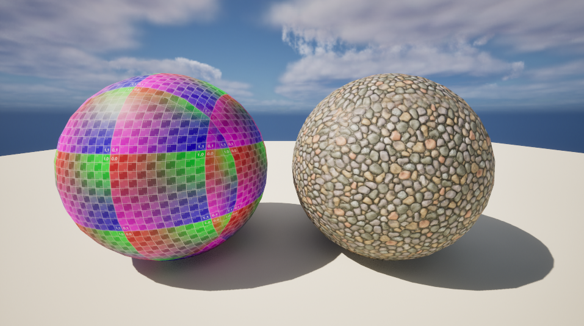
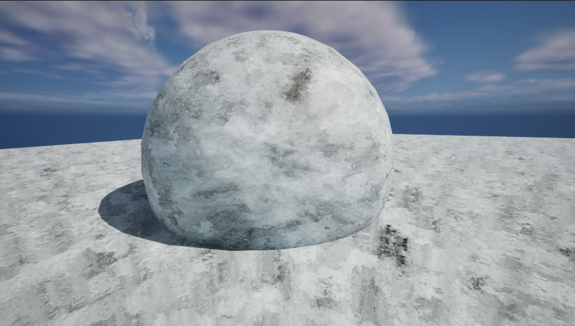
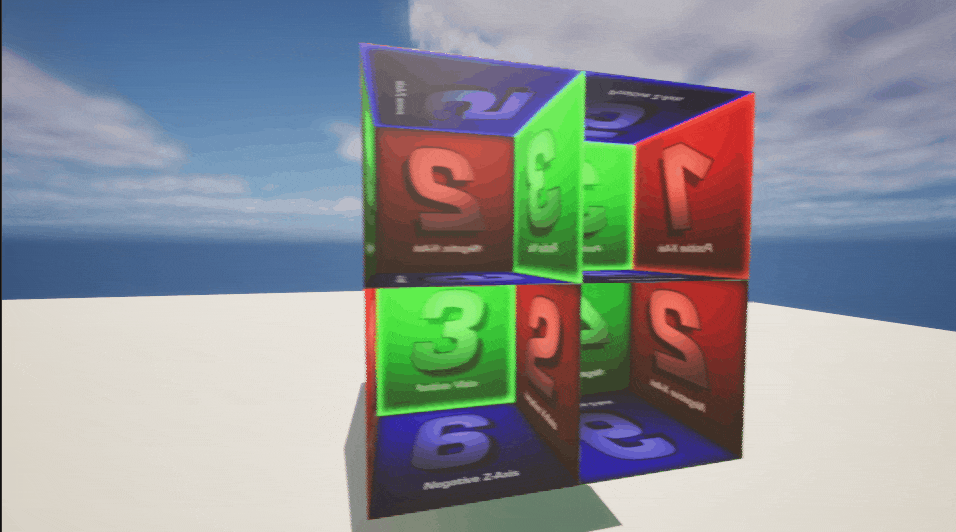
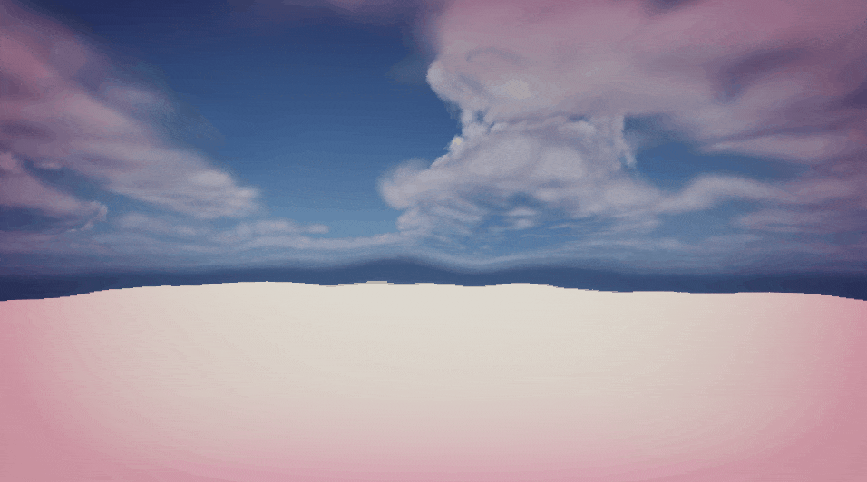
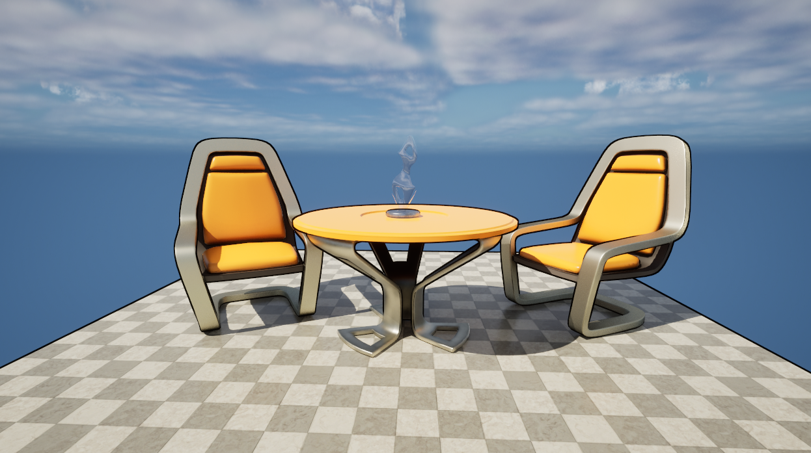
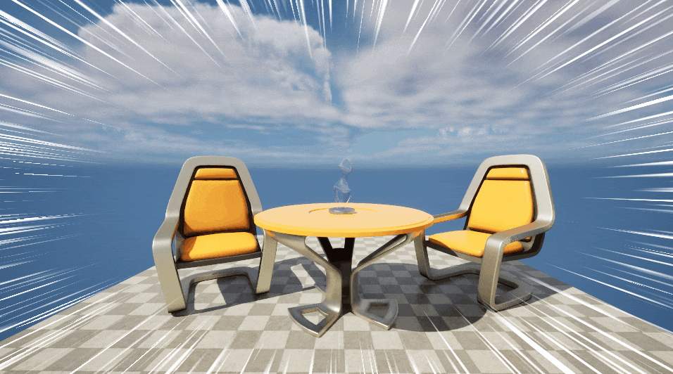
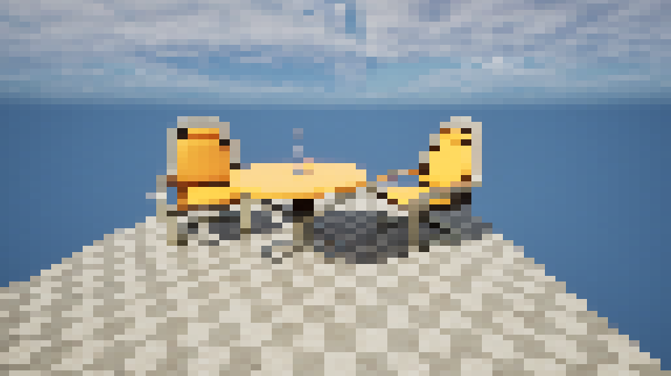

# LearnUnrealShader

记录学习Unreal Shader过程中实现的一些Demo。

> Version: Unreal Engine 5.3.2

## TriPlanarProjection

## Ice

## InteriorCube

## SimplePostProcess

## Outline

## ActionLines

## PixelationFilter

